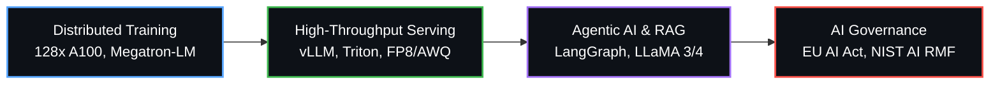

# ⚡ Hi there, I'm Siva Kandula

<div align="center">
  <a href="https://linkedin.com/in/kandulasivaramireddy" target="_blank">
    
  </a>
  <a href="https://huggingface.co/Siva-Kandula" target="_blank">
    
  </a>
  <a href="mailto:sivakandula.ai@gmail.com">
    
  </a>
  <a href="https://github.com/Siva-Kandula" target="_blank">
    
  </a>
</div>

<h3 align="center">Full-Stack Senior Machine Learning Engineer & Tech Lead</h3>
<p align="center"><b>Foundation Models (13B, Megatron-LM) • Agentic AI (LangGraph) • High-Throughput Serving (vLLM, Triton) • AI Governance (EU AI Act, NIST)</b></p>

---

## 💡 Executive Summary

I am a **Senior Machine Learning Engineer and Tech Lead** with **8+ years of experience** bridging the gap between foundational AI research/infrastructure and high-availability enterprise production systems. Currently serving as the Tech Lead for the Finance AI initiative within ServiceNow's Office of the CFO, I lead a squad of engineers architecting production ML platforms—scaling from **13B parameter LLM pretraining** to highly autonomous **Agentic Workflows** and advanced **Multivariate Forecasting engines**.

My core engineering philosophy centers on **High-Throughput MLOps, Distributed System Design, and Operationalized AI Governance**. I specialize in optimizing heavy AI inference pipelines to achieve extreme latency SLOs and massive compute cost savings, while ensuring strict global compliance (EU AI Act, NIST AI RMF).



---

## 🛠️ Core Technical Expertise & Stack

### 🚀 High-Throughput Inference & Serving
- **Engines & Servers**: `vLLM`, `Triton Inference Server`, `ONNX Runtime`, `TensorRT-LLM`
- **Optimization Techniques**: `FP8 / AWQ / INT4 Quantization`, `Speculative Decoding`, `Prefix Caching`, `Continuous Batching`, `KV-Cache Optimization`
- **Impact**: Reduced Time-to-First-Token (TTFT) by **43%** (320ms to 180ms at 34 req/GPU), saving **$45K/year** in GPU compute.

### 🧠 Foundation Models & Distributed Training
- **Frameworks**: `PyTorch (Expert)`, `PyTorch FSDP2`, `Megatron-LM`, `DeepSpeed ZeRO 1-3`, `FlashAttention-2`, `Liger Kernel`
- **Architectures & Scaling**: `13B Transformers`, `3D Parallelism`, `RoPE Scaling (NTK-aware, YaRN 4K–32K)`, `Custom 64K BPE Multilingual Tokenizers`
- **Alignment & Fine-Tuning**: `Supervised Fine-Tuning (SFT)`, `Direct Preference Optimization (DPO)`, `LoRA / QLoRA`, `PEFT`, `Knowledge Distillation`

### 🤖 Generative AI & Agentic Systems
- **Agentic Workflows**: `LangGraph`, `LangChain`, `Autonomous LLM Agents (LLaMA 3/4, GPT-4o)`
- **Advanced RAG**: `Hybrid RAG (Dense + Sparse BM25)`, `Embedding Reranking`, `Grounded-Citation Enforcement`, `Vector DBs (Pinecone, Milvus, FAISS)`
- **Observability & Guardrails**: `Langfuse (LLM Tracing)`, `NeMo Guardrails`, `Real-time Triage Automation`

### 📈 Advanced Time-Series & Forecasting
- **Neural Forecasting**: `Temporal Fusion Transformers (TFT)`, `DeepAR`, `Multivariate Financial Time-Series`, `Quantile Outputs`
- **Classical & Baselines**: `ARIMA / ETS`, `Capital Allocation Optimization`

### 🛡️ Production MLOps, Infra & AI Governance
- **Cloud & Orchestration**: `Kubernetes (EKS, ACK)`, `Docker`, `Terraform`, `AWS (SageMaker)`, `GCP Vertex AI`, `Azure ML`
- **MLOps Pipelines**: `Kubeflow`, `MLflow`, `CI/CD for ML`, `Grafana / Prometheus (Drift & Latency SLOs)`
- **AI Governance**: `EU AI Act Compliance`, `NIST AI RMF Alignment`, `GDPR`, `ServiceNow AI Control Tower`, `Bias/Fairness Evaluation`, `Model Cards`

### 💻 Software Engineering & Foundations
- **Languages**: `Python (Expert, OOP, Async)`, `C++ (Performance-Critical)`, `Java`, `SQL`
- **Design & Architecture**: `Distributed Systems Architecture`, `High-Concurrency Search Indexes (Lucene)`, `Spring Boot`

---

## 🏆 Key Architectural & Business Impact

| Domain | Highlight / Initiative | Measurable Impact |
| :--- | :--- | :--- |
| **LLM Serving** | **High-Throughput Production Serving (vLLM/Triton)** | Optimized production serving using **FP8 quantization, speculative decoding, and prefix caching**. Reduced TTFT from 320ms to 180ms, delivering **34 requests/GPU** and saving **~$45K annually** in compute costs with 99.9% availability. |
| **Model Training** | **13B Foundation Model Pretraining (Megatron-LM)** | Led end-to-end pretraining of a **13B parameter transformer** on **128x A100 GPUs** using 3D parallelism. Achieved **1.7x training throughput** and raised MFU from 38% to 47% via FlashAttention-2 and Liger Kernel. |
| **Agentic AI** | **Autonomous Finance AI Workflows (LangGraph)** | Architected robust agentic workflows (**LLaMA 3/4 + LangGraph**) and hybrid dense+sparse RAG pipelines. Achieved a **40% reduction in issue triage** and saved the enterprise finance team **120+ hours/month**. |
| **Model Compression**| **Chained LLM Compression Pipeline** | Built an end-to-end compression pipeline: **Structured Pruning** (30% heads, 25% MLP dims) ➔ **KL-Divergence Distillation** ➔ **AWQ INT4 Quantization**, yielding a **6x smaller model** with **3.5x higher throughput**. |
| **Enterprise Search**| **Billion-Scale Retrieval Infrastructure (ADP)** | Engineered Lucene-based search index architectures powering Dense Passage Retrieval (DPR) for MyADP, serving **1B+ annual logins**. Implemented caching/sharding to cut query latency by **35%**. |
| **Computer Vision** | **Edge Geospatial CNN Pipelines (Hexagon)** | Co-led development of a production CNN pipeline deployed via **ONNX Runtime on edge devices** with **96% accuracy**. Awarded *Star Employee of the Year 2020*. |

---

## 💼 Professional Experience

```
+-----------------------------------------------------------------------------------+
| ServiceNow                Senior Machine Learning Engineer (Tech Lead)            |
| Jan 2023 – Present        AI Platform & LLM Systems | Hyderabad, India            |
|                           • Tech lead for Finance AI (Office of the CFO).         |
|                           • Managing 3 engineers; architecting LLM pretraining,   |
|                             agentic workflows, vLLM serving, and AI Governance.   |
+-----------------------------------------------------------------------------------+
                                        |
                                        v
+-----------------------------------------------------------------------------------+
| ADP                       Senior Member Technical                                 |
| Sep 2021 – Dec 2022       Search & NLP Systems | Hyderabad, India                 |
|                           • Built Lucene/DPR search index infra for 1B+ logins.   |
|                           • Designed precision-evaluation frameworks (SBERT).     |
+-----------------------------------------------------------------------------------+
                                        |
                                        v
+-----------------------------------------------------------------------------------+
| Hexagon                   Senior Software Engineer                                |
| Sep 2018 – Sep 2021       Computer Vision & ML Systems | Hyderabad, India         |
|                           • Deployed edge CNN pipelines via ONNX Runtime (96%).   |
|                           • Accelerated 3 major release cycles by 2 months each.  |
+-----------------------------------------------------------------------------------+
```

---

## 🎙️ Certifications, Leadership & Speaking

- 🥇 **Hackathon Winner**: *Best Architect, Hackathon21* — NLP-driven parser for unstructured data.
- 🗣️ **Invited Talks**: Guest lectures on *AI Adoption & AI Governance*, K L University (2024, 2025).
- 👥 **Mentorship & Leadership**: Tech lead managing 3 engineers; recurring code-review & system-design coaching across enterprise production squads.
- 📜 **Agile Certifications**: Certified Scrum Product Owner (CSPO), Certified ScrumMaster (CSM) — Scrum Alliance.
- 🎓 **Education**: Bachelor of Technology in Mathematics & Programming, K L University (2013 – 2017).

---

## 📊 GitHub Analytics & Activity

<div align="center">
  
  
</div>

---

## 📬 Get In Touch

> *"Always open to conversations on production ML at scale, distributed system design, and the engineering side of AI governance. Reach out anytime."*

<div align="center">
  <b>📧 <a href="mailto:sivakandula.ai@gmail.com">sivakandula.ai@gmail.com</a> | 🔗 <a href="https://linkedin.com/in/kandulasivaramireddy" target="_blank">LinkedIn Profile</a> | 📍 Hyderabad, India</b>
</div>
